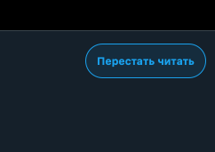

<h1 align="center">TwitterClone</h1>

## Description
Python realisation of twitter clone backend.

Use the form to change users for testing.

Database contains four users with api-keys:

    test, test2, test3, test4

## Implemented

### Post new tweet and delete it

Users can tweet a text message and attach one or several images.

Any user can delete his own tweet at any time.

### Like and unlike

Users can add and remove likes.

### Follow and unfollow

Users can follow other users and remove following.

## About the project

Based on Python 3.12, Nginx, FastAPI, PostgreSQL, Docker.

Covered with tests using Pytest.

## Documentation

Api documentation accessible by:

    http://hostaddress/api/docs
    http://hostaddress/api/redoc

Change 'hostaddress' to ip of host running project.

## Setup enviroment variables
### This operation is required!!!

Copy or rename '.tempate' file to .env file in the 'envs' directory. Then fill it with your values.

## Running

    docker-compose up -d

For development and testing:

    pip install -r requirements_dev.txt
    docker-compose -f docker-compose-dev.yaml up -d